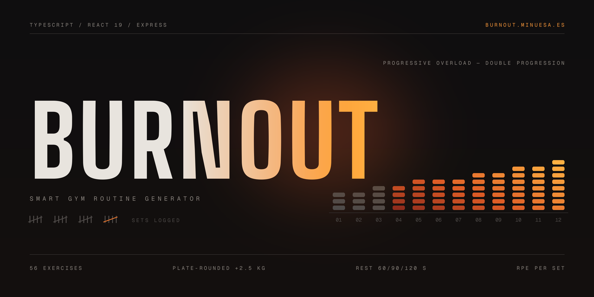

# 🔥 BurnOut — Generador Inteligente de Rutinas de Gimnasio

**[English](README.md)** · **Español**

> Abre la app en el gimnasio, elige tu split y tu objetivo, y obtén al instante un entrenamiento personalizado — con pesos sugeridos, temporizador de descanso, registro serie a serie y progresión automática.

**🌐 Demo en vivo: [burnout.minuesa.es](https://burnout.minuesa.es)** · Sin registro, funciona en el móvil.

<!-- TODO: añadir una captura de pantalla o GIF corto aquí — docs/screenshot.png -->

[](https://www.typescriptlang.org/)
[](https://react.dev/)
[](https://nodejs.org/)
[](https://expressjs.com/)
[](https://vitejs.dev/)
[](https://vitest.dev/)
[](https://zod.dev/)
[](https://vercel.com/)

---

## Qué hace

1. **Entrada** — Seleccionas un split (*Tren Superior*, *Tren Inferior*, *Full Body*), un objetivo (*Perder Peso*, *Volumen*, *Mantenerse Activo*) y tu perfil biofísico (peso, altura, edad, sexo, experiencia).
2. **Generación** — La API construye una rutina estructurada: calentamiento → 5–6 bloques de ejercicios → vuelta a la calma, a partir de una biblioteca de **56 ejercicios clasificados** con vídeos demostrativos.
3. **Valores iniciales inteligentes** — Los pesos de partida se calculan por ejercicio a partir de tu peso corporal, sexo y experiencia usando ratios de fuerza estándar, redondeados a discos de 2,5 kg.
4. **Entrenamiento** — Registras peso real, repeticiones y RPE por serie. Al completar una serie se activa un temporizador de descanso ajustado a tu objetivo (60/90/120 s). ¿No te gusta un ejercicio o la máquina está ocupada? El **Re-roll** lo cambia por otro del mismo grupo muscular, sin tocar el resto de la rutina.
5. **Progresión** — El historial de entrenamientos se persiste y se envía a la API: la siguiente rutina aplica **doble progresión** (más repeticiones → más peso) por ejercicio, y la interfaz muestra una insignia con la dirección de progresión en cada tarjeta.

Además: resumen del entrenamiento (volumen total, series completadas, RPE medio), racha de entrenamientos y **modo offline** — la rutina activa sobrevive a recargas y pérdidas de conexión gracias a LocalStorage, con generación de emergencia en el cliente si el servidor no responde.

## Puntos destacados de ingeniería

Las partes que querría que mirases como revisor:

- **Backend con arquitectura por capas** — `Rutas → Controladores → Servicios → Repositorios`, con inyección de dependencias en el punto de composición ([`routineRoutes.ts`](backend/src/routes/routineRoutes.ts)). La lógica de negocio vive en los servicios y es agnóstica del framework.
- **Patrón repositorio para una migración de BBDD indolora** — los ejercicios se sirven actualmente desde JSON estático detrás de una interfaz `IExerciseRepository`. Cambiar a MongoDB (Fase 3 planificada) significa escribir una única clase repositorio nueva; la capa de servicios no cambia.
- **Validación de entrada con Zod** — cada endpoint valida su payload contra un esquema antes de llegar a la lógica de negocio ([`userProfile.schema.ts`](backend/src/schemas/userProfile.schema.ts)).
- **34 tests automatizados** (28 backend + 6 frontend, Vitest) que cubren el algoritmo de generación de rutinas, el motor de progresión y la lógica de historial. La lógica central está escrita como **funciones puras** ([`frontend/src/lib/history.ts`](frontend/src/lib/history.ts)) precisamente para poder testearla sin mockear React ni Express.
- **Custom hooks para separar responsabilidades** — `useWorkout`, `useStreak`, `useRestTimer`, `useHistory` mantienen `App.tsx` declarativo y cada responsabilidad testeable de forma independiente.
- **Tipos de dominio compartidos** — los contratos `WorkoutRoutine` / `RoutineSet` están tipados de extremo a extremo en TypeScript a ambos lados de la API.

## API

| Método | Endpoint | Descripción |
|---|---|---|
| `POST` | `/api/routines/generate` | Genera una rutina a partir de split + objetivo + perfil de usuario (+ historial de entrenamientos para la progresión) |
| `POST` | `/api/routines/reroll` | Sustituye un ejercicio por otro del mismo grupo muscular, excluyendo los que ya están en la rutina |

## Stack tecnológico

| Capa | Tecnología |
|---|---|
| Frontend | React 19, TypeScript, Vite, custom hooks, CSS (mobile-first, modo oscuro) |
| Backend | Node.js, Express, TypeScript, Zod |
| Testing | Vitest (backend + frontend) |
| Datos | JSON estático detrás de una interfaz repositorio (preparado para MongoDB) |
| Despliegue | Vercel (frontend, dominio propio) + Render (API Express) |

## Ejecútalo en local

```bash
git clone https://github.com/Mariomin23/BurnOut.git
cd BurnOut
npm run install:all   # instala dependencias de backend + frontend
npm run dev           # arranca la API y el servidor de desarrollo de Vite a la vez
```

Ejecuta los tests:

```bash
npm test --prefix backend    # 28 tests
npm test --prefix frontend   # 6 tests
```

## Hoja de ruta

- ✅ **Fase 1** — Generación de rutinas, re-roll, temporizador de descanso, pesos sugeridos, modo offline, rachas
- ✅ **Fase 2A** — Historial de entrenamientos + algoritmo automático de doble progresión
- 🔜 **Fase 2B** — Gráficos de progreso por ejercicio (peso vs. semanas)
- 🔮 **Fase 3** — MongoDB + autenticación (JWT) para historial por usuario, PWA completa

## Sobre el proyecto

Creado por **Mario Minuesa** ([@Mariomin23](https://github.com/Mariomin23)) como proyecto full-stack de portfolio: diseño de producto, arquitectura, implementación, testing y despliegue, de principio a fin.
